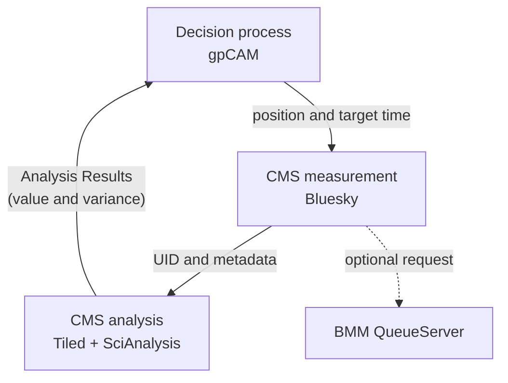
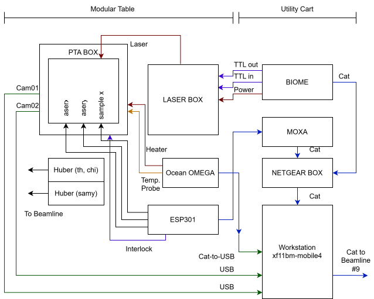

# CMS PTA Experiment SOP and Documentation Package

## Contents

- [CMS PTA Experiment SOP and Documentation Package](#cms-pta-experiment-sop-and-documentation-package)
  - [Contents](#contents)
  - [PTA System Overview](#pta-system-overview)
    - [Functional flow](#functional-flow)
    - [Hardware Connection](#hardware-connection)
    - [Beamline control layer](#beamline-control-layer)
      - [EPICS (TODO)](#epics-todo)
      - [IOC](#ioc)
      - [Bluesky control scripts](#bluesky-control-scripts)
      - [Decision process](#decision-process)
      - [Analysis process](#analysis-process)
      - [Optional BMM path](#optional-bmm-path)
  - [July 15, 2026 PTA Setup Snapshot](#july-15-2026-pta-setup-snapshot)
    - [Reported software locations](#reported-software-locations)
    - [Beam and detector setup](#beam-and-detector-setup)
    - [Runtime directories](#runtime-directories)
    - [Helper functions](#helper-functions)
  - [Standard Operating Procedure: CMS PTA Experiment](#standard-operating-procedure-cms-pta-experiment)
    - [Beamline Preparation Procedure](#beamline-preparation-procedure)
    - [Sample Alignment Procedure](#sample-alignment-procedure)
    - [BMM QueueServer setup procedure](#bmm-queueserver-setup-procedure)
    - [BMM operating(draft)](#bmm-operatingdraft)
    - [Running an in situ PTA autonomous experiment (draft)](#running-an-in-situ-pta-autonomous-experiment-draft)
    - [Pause, stop, and cleanup (draft)](#pause-stop-and-cleanup-draft)
  - [Developer Notes and Future Work](#developer-notes-and-future-work)
    - [Priority checklist](#priority-checklist)
      - [P1](#p1)
      - [P2](#p2)
      - [P3](#p3)
    - [Configuration file draft](#configuration-file-draft)
    - [Message model draft](#message-model-draft)
    - [Hardware considerations](#hardware-considerations)

---

## PTA System Overview

### Functional flow

The live workflow has three ZeroMQ processes and an optional BMM QueueServer path.



The source currently assigns these endpoints in [`CustomQueue.py`](./CustomQueue.py):

| Role         | Host in source | Port | Start Order* |
| ------------ | -------------- | ---: | ------------ |
| Decision     | `xf11bm-ws2`   | 5551 | 3            |
| Measurement  | `xf11bm-ws1`   | 5552 | 1            |
| CMS analysis | `xf11bm-ws2`   | 5559 | 2            |
| BMM analysis | `xf11bm-ws2`   | 5555 | optional     |

\* Verify current hostname, address, and firewall rule ahead of beamtime.

TODO:

- [ ] Move these values to a versioned configuration file.

### Hardware Connection



This map identifies the following components:

- PTA enclosure and interface box
  - Two USB cameras
  - IR Laser Source
  - 3 motors (samx, laserx, lasery)
  - Sample Stage with N2 gas feed
  - Cartridge Heater and Thermal probe
  - Sample Stage Cap
- On the Modular table
  - Laser control and interlock box
  - Ocean OMEGA temperature readout
  - ESP301 motion controller
- On the Utility cart
  - Workstation `xf11bm-mobile4`
  - BIOME interface
  - MOXA serial/network device
  - NETGEAR network device
- Other Components from beamline
  - Huber theta/chi stages
  - Huber y stages
  - Network and Power connections to beamline

Reference: [PTA_connection_map.drawio](./PTA_connection_map.drawio)

### Beamline control layer

#### EPICS (TODO)

#### IOC

The following Input/Output Controllers (IOCs) run on `xf11bm-mobile4`. You can connect using a beamline staff account, for example `ssh -X swu4@xf11bm-mobile4`.

Use `manage-iocs status` to show the status of all IOCs.

```bash
[swu4@xf11bm-mobile4 ~]$ manage-iocs status
IOC Name                       Status     Auto-Start     
---------------------------------------------------------
biome                          Running    Registered 
cam1                           Running    Registered   
cam2                           Running    Registered    
logitechF710                   Running    Registered     
newportESP301                  Running    Registered   
Omega78000                     Running    Registered 
```

> [!Note]
>
> 1) To restart an IOC, use `manage-iocs restart <ioc_name>`
> 2) For USB cameras, if the display does not refresh automatically, manually refresh the page instead of restarting the IOC.

#### Bluesky control scripts

The following scripts should be executed in the Bluesky environment on CMS beamline workstation 1. After starting Bluesky, import and run each script with `%run -i <script_path>`:

[`PTA_hardware.py`](./PTA_hardware.py) defines the laser output device using Ophyd and EPICS process variables.

[`user_PTA_zmq.py`](./user_PTA_zmq.py) contains sample motion, alignment, coupled sample/laser motion, measurement, and queue interaction.

#### Decision process

The following script should be executed in a separate terminal on the CMS beamline workstation 2. This setup is subject to change depending on the user customization and experimental requirements.

The decision process script has already been configured with a `pixi` environment (see `./pixi.toml`). To start the decision process, use:

```bash
pixi run time_position_mapping.py
```

[`time_position_mapping.py`](./time_position_mapping.py) runs a two-dimensional Gaussian-process optimizer over position and elapsed time. The current source includes:

- position range of 1–30 mm;
- experiment duration of 2 h;
- five random initialization measurements;
- motor speed estimate of 3 mm/s;
- measurement-cost estimate of 15 s;
- a 120 s request horizon;
- variance-based acquisition;
- periodic hyperparameter retraining.

All values are experiment configuration and must be copied into the run record. Position bounds must be derived from the verified usable sample region.

#### Analysis process

The following script should be executed in a separate terminal on CMS beamline workstation 2. This is also subject to change based on user customization and experimental requirements.

As of cycle 2026-2, the analysis process has not been configured with a `pixi` environment. To start the analysis process, activate a conda environment and run the script directly with Python:

```bash
conda activate <analysis_environment>
python autonomous_smaxs08.py
```

[`autonomous_smaxs08.py`](./autonomous_smaxs08.py) performs these steps:

1. Receive the measured bluesky run UID from the measurement queue.
2. Retrieve SAXS and MAXS arrays from Tiled.
3. Write working TIFF images. [Unnecessary workaround, to be removed]
4. Apply calibration and masks from `caliXS.yaml`, `caliMS.yaml`, and the combined mask images `combined_mask_SAXS.png` and `combined_mask_MAXS.png`.
5. Run SciAnalysis protocols. [Subject to customization per user needs]
6. Extract the selected value and variance.
7. Publish the analyzed point to the decision queue.

The current primary MAXS objective is a fitted full width at half maximum (FWHM). The current SAXS branch extracts a peak from a Kratky-style line cut. Both definitions must be reviewed for the specific material system before beamtime.

As of cycle 2026-2, raw image arrays are intended to be read from Tiled. The analysis process then writes working files under the run directory and passes analyzed results through `CMSsaves`/`CMStotals` to the decision process. The Canvas lists both `KCWiegart` and `KChen-Wiegart` staff directories for runtime and backup data; this inconsistency must be resolved in a single run configuration.

TODO:

- [ ] Refactor the SciAnalysis execution logic so it does not have to read a file
- [ ] Refactor the analysis process to make it modular and configuration-driven.
- [ ] Add SciAnalysis and related dependencies to the same pixi environment

#### Optional BMM path

[`qserver_comm.py`](./qserver_comm.py) submits `CMS_driven_measurement` plans to the BMM Bluesky QueueServer. This path requires a valid protected authorization key, an agreed plan signature, BMM readiness, and a documented queue ownership policy. **Contact with BMM staff** is necessary to obtain the required authorization and confirm readiness.

Two CMS measurement modes have different BMM behavior:

| Mode                           | BMM trigger behavior                                                         |
| ------------------------------ | ---------------------------------------------------------------------------- |
| `measureAutonomous_drivingBMM` | Submits after the experiment clock passes the next scheduled BMM threshold   |
| `measureAutonomous_withBMM`    | Attempts to submit for every CMS measurement while a BMM clock entry remains |

---

## July 15, 2026 PTA Setup Snapshot

### Reported software locations

| Role                    | Canvas path                                                                                                        |
| ----------------------- | ------------------------------------------------------------------------------------------------------------------ |
| CMS/Bluesky measurement | `/nsls2/auto-storage/cms/shared/config/bluesky/profile_collection/users/2026-2/KCWiegart/user_PTA_zmq.py`          |
| gpCAM decision          | `/nsls2/auto-storage/cms/shared/config/bluesky/profile_collection/users/2026-2/KCWiegart/time_position_mapping.py` |
| On-the-fly analysis     | `/nsls2/auto-storage/cms/shared/config/bluesky/profile_collection/users/2026-2/KCWiegart/autonomous_smaxs08.py`    |
| Temporary runtime data  | `/nsls2/auto-storage/cms/shared/config/bluesky/profile_collection/users/2026-2/KChen-Wiegart/data`                 |

### Beam and detector setup

| Item             | Value                                  | Notes                                                       |
| ---------------- | -------------------------------------- | ----------------------------------------------------------- |
| Energy           | 17 keV                                 |                                                             |
| Slits 2          | 0.2 mm × 0.05 mm                       | typical GI-SWAXS setup                                      |
| Slits 3          | ~ 0.5 mm × 0.4 mm                      | Beam cleanup                                                |
| Beamstop         | Rod                                    | typical GI-SWAXS setup                                      |
| SAXS position    | x ≈ −65, y ≈ −65                       | shift y from -73 to -65 to see the reflection beam at 0.25° |
| MAXS position    | x ≈ 0, y ≈ −132                        | Subject to change                                           |
| SAXS beam center | `[742, 1127]` px                       | x ≈ −65, y ≈ −65                                            |
| SAXS distance    | 6.02 m                                 | calibrated in `caliXS.yaml`                                 |
| SAXS standard    | AgBH                                   | Measured before experiment                                  |
| MAXS standard    | CeO₂                                   | Measured before experiment                                  |
| Incident angle   | 0.25° or 0.20° in one function default | Depends                                                     |

### Runtime directories

The following folder lives under `profile_collection/users/2026-2/KCWiegart` to store temporary runtime data. 

```text
maxs/raw
maxs/analysis
saxs/raw
saxs/analysis
CMSsaves
CMStotals
BMMsaves
BMMtotals
```

> [!NOTE]
> Create these folders before starting experiments. Confirm that the beamline operating account `xf11bm` has write access and available capacity. Archive all to user's proposal folder before cleanup.

### Helper functions

Below is an ad-hoc set of helper functions that were used to make users' lives easier. Parameters are hard-coded and should be verified before use.

```python
def changeSample():
    yield from move_sample_with_laser(25)
    yield from bps.mv(smx, -100)

def newSample():
    yield from bps.mv(smx, 25)
    yield from bps.mv(laserx, -68.778)
```

These functions should run with RunEngine (RE). For example `RE(changeSample())`. `changeSample()` is to move the sample stage to a position close to the PTA box door. `newSample()` is to move the sample stage to the align position where sample start, x-ray, and laser beams are properly aligned.

## Standard Operating Procedure: CMS PTA Experiment

### Beamline Preparation Procedure

1. Roughly locate sample-x and laser-x using the rulers/cameras and fixture geometry.
2. Switch the beam energy to 17 keV and optimize the slit/beamstop configuration.
3. Locate sample-y using a dummy sample.
4. Scan sample-x across a defined bare-substrate/strip edge to distinguish empty beam, film/substrate, and clamp regions.
5. Move the sample to the initial measurement position using `RE(move_sample_with_laser(XX))`, set the laser power to `1`, and check if the laser and x-ray beams are properly aligned, change the laser_x position as needed. Update `def newSample()` accordingly.
6. Set ROI on the camera to focus on the region of interest.
7. Move inside the usable film region using `RE(move_sample_with_laser(XX))`, and acquire a quick SAXS/MAXS exposure at the desired incident angle.
8. Optimize the detector position as needed for the desired measurement geometry.
9. Make mask using the quick SAXS/MAXS exposure, save as `combined_mask_SAXS.png` and `combined_mask_MAXS.png`.
10. Calibrate the SAXS and MAXS detectors position using a standard material (AgBH for SAXS, CeO₂ for MAXS)
11. Save the calibration parameter to `caliXS.yaml` and `caliMS.yaml`
12. Edit SAXS calibration helper script in `user_PTA_zmq.py`, in `cms.SAXS.setCalibration([742, 1127], 5.9, [-65, -65])`
13. Set the Runtime metadata in `user_PTA_zmq.py`, for example: `RE.md(['experiment_alias_directory']) = '1_PTA'`

### Sample Alignment Procedure

1. Define a new sample: `sam = Sample('Sample_Name')`.
2. Scan sample-x across a defined bare-substrate/strip edge to distinguish empty beam, film/substrate, and clamp regions.
3. Set the origin of the sample using `sam.setOrigin(['x','y','th'])`
4. Align the start endpoint using `cms.modeAlignment` and `sam.align()` and call `sam.setStartPos()`.
5. Align the end endpoint and call `sam.setEndPos()`.
6. Record and check all six endpoint values using `sam.start_x, sam.start_y, sam.start_th, sam.end_x, sam.end_y, sam.end_th`

> [!NOTE]
> It may be easier to align sample start endpoints ~1mm away from the edge, to make sure the beam is on the film.

The sample surface is represented by two aligned endpoints. For target sample-x position `x`, the current code linearly interpolates sample-y and theta:

$$
y(x)=y_1+\frac{x-x_1}{x_2-x_1}(y_2-y_1), \qquad
\theta(x)=\theta_1+\frac{x-x_1}{x_2-x_1}(\theta_2-\theta_1).
$$

### BMM QueueServer setup procedure

The queue monitor command was:

```bash
pixi run qm
```

The monitor task should be connected to `https://xf06bm-bmm-qs1.nsls2.bnl.gov:443`.

### BMM operating(draft)

TBD: Describe the BMM operating modes and procedures here.

### Running an in situ PTA autonomous experiment (draft)

1. To start the in situ PTA Autonomous Experiment, execute the following commands:
`laserOn(); time.sleep(300); laserOff(); measureAutonomous_drivingBMM`
2. During the autonomous experiment, periodically inspect:

   - laser readback;
   - sample condition from cameras;
   - temperature and other hardware readbacks;
   - SAXS/WAXS data from the detector, data analysis results, and gpCAM status.
  
3. After the autonomous experiment command, perform a sample X scan:
  `sampleXscan(exposure_time=10, extra='afterAE_xscan', align=False)`

### Pause, stop, and cleanup (draft)

`flush.sh` removes `.npy` files from `BMMsaves`, `BMMtotals`, `CMSsaves`, and `CMStotals` relative to the current directory.
Use only from the intended runtime directory.

---

## Developer Notes and Future Work

### Priority checklist

#### P1

- [ ] Add a tested fail-safe shutdown wrapper for all live entry points; always force laser-off and verify readback.
- [ ] Split live and simulation analysis paths in `autonomous_smaxs08.py`; remove hard-coded mock branch from live mode.
- [ ] Reject failed/invalid analysis results explicitly; never send default/random fallback values to gpCAM.
  
#### P2

- [ ] Fix `agent_feedback_time_plan` use of `self.clock()` in free-function context; define one clear time source.
- [ ] Add bounded timeouts and explicit error states for file waits, queue waits, and detector/Tiled waits.
- [ ] Replace fixed Tiled sleep with readiness polling + timeout before array access.
- [ ] Move hard-coded hosts/ports/paths/keys/science parameters into configuration files.
- [ ] Define restart and deduplication behavior by UID/point ID to prevent duplicate measurements or optimizer updates.
- [ ] Harden `flush.sh`: require explicit target directory and confirmation/safety checks before deletion.

#### P3

- [ ] Move historical coordinates and laser settings out of executable code.
- [ ] Confirm `single_plan_per` signature and caller arguments; add an integration test before enabling BMM submission.
- [ ] Keep runtime data outside the repository in run-specific directories.
- [ ] Break up large scripts by responsibility:
  - [ ] clean up legacy code that is unused in `user_PTA_zmq.py`.
  - [ ] Split `autonomous_smaxs08.py` into analysis core, tiled I/O, orchestration, and simulation etc. (Or introduce live data analysis pipeline)
- [ ] Introduce project structure with dedicated `config/`, `docs/`, `src/pta/`, `scripts/`, and `tests/` folders.
- [ ] Add automated tests.

### Configuration file draft

- [ ] Deployment config: roles, hosts, ports, bind/connect direction, Tiled profile, QueueServer endpoint.
- [ ] Experiment config: proposal path, exposure, incident angle, duration, time origin.
- [ ] Analysis config: detector setup, expected outputs, calibration files, masks, Tiled options.
- [ ] Decision config: bounds, initial points, cost model, request horizon, kernel, retraining schedule.

### Message model draft

- [ ] Add a versioned command/result schema for all queue messages.
- [ ] Include fields: schema version, experiment ID, run segment, point ID, created time, target position/time, state, UID, value, uncertainty, failure code, retry count, provenance.
- [ ] Enforce state transitions:
  - [ ] `REQUESTED -> MOVING -> MEASURED -> DATA_READY -> ANALYZED -> ACCEPTED`
  - [ ] `ANALYZED -> REJECTED` when analysis quality gates fail
  - [ ] Any state can transition to `FAILED` or `CANCELLED`
- [ ] Enforce idempotency using UID + point ID.

### Hardware considerations

- [ ] Confirm lid/frame clearance and laser-stage position that avoids beam obstruction.
- [ ] Stable USB camera connection.

---
